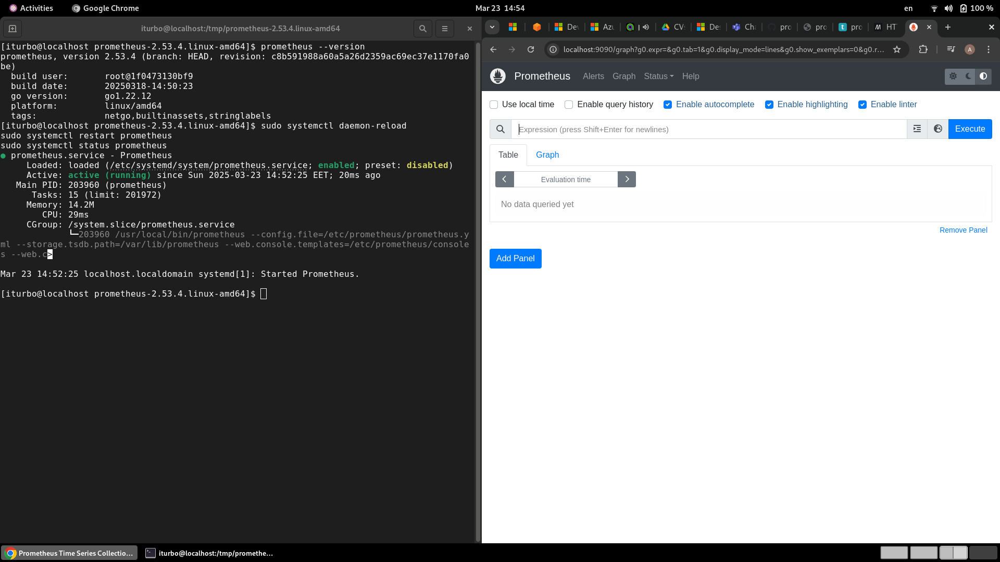
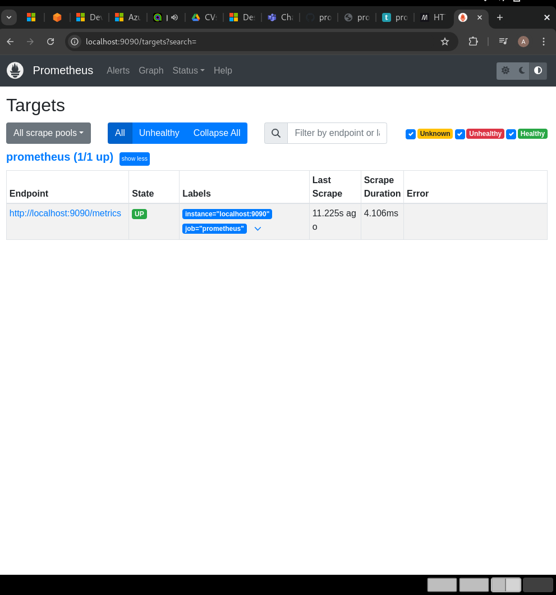
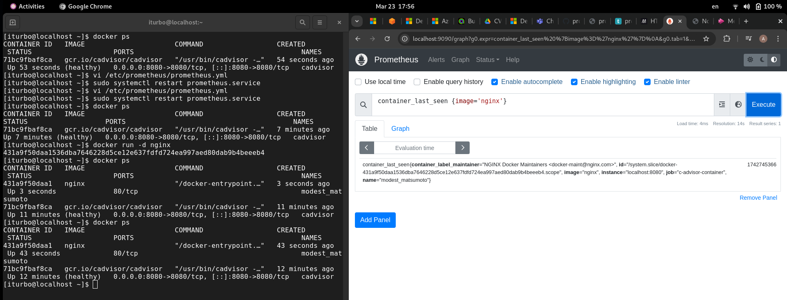

## 1. What is differnect http status code and explain meaning of each of them ? 

### 1xx - Informational Responses

- 100 Continue – The server received the request headers and the client can continue sending the body.

- 101 Switching Protocols – The server switches protocols as requested by the client (HTTP to WebSockets).

- 102 Processing – The request is being processed but not yet completed.

### 2xx - Success Responses

- 200 OK – The request was successful, and the response contains the requested resource.

- 201 Created – The request resulted in a new resource being created.

- 202 Accepted – The request was accepted but is still being processed.

- 204 No Content – The request was successful, but there is no content in the response.

### 3xx - Redirection Responses

- 301 Moved Permanently – The requested resource has been permanently moved to a new URL.

- 302 Found – The resource is temporarily located at a different URL.

- 304 Not Modified – The resource has not changed since the last request (used for caching).

- 307 Temporary Redirect – The resource is temporarily available at a different URL, but the same request method should be used.

- 308 Permanent Redirect – Similar to 301 but retains the original request method.

### 4xx - Client Errors

- 400 Bad Request – The request was malformed or contained invalid syntax.

- 401 Unauthorized – Authentication is required to access the resource.

- 403 Forbidden – The client is not allowed to access the resource.

- 404 Not Found – The requested resource does not exist on the server.

- 405 Method Not Allowed – The HTTP method used is not supported for this resource.

- 408 Request Timeout – The server timed out waiting for the client’s request.

- 429 Too Many Requests – The client has sent too many requests in a short period (rate limiting).

### 5xx - Server Errors

- 500 Internal Server Error – A generic error indicating something went wrong on the server.

- 502 Bad Gateway – The server received an invalid response from an upstream server.

- 503 Service Unavailable – The server is temporarily unavailable due to overload or maintenance.

- 504 Gateway Timeout – The server did not receive a timely response from an upstream server.

---

 ##  2. What database is used by Prometheus?

- Prometheus uses Prometheus TSDB (Time Series Database) as its built-in storage engine. This database is optimized for storing and querying time-series data efficiently.

---
## 3. What is the differnece between different metrics types ( counter , gauge , histogram)

### Counter
A Counter is a metric that only increases (or resets to zero). It is typically used to track things like the number of requests, errors, or completed tasks.

-  Use Cases:
   - Number of HTTP requests received (http_requests_total)

   - Number of failed jobs (job_failures_total)

   - Total bytes sent over a network

### Gauge 

A Gauge is a metric that can go up and down over time. It is used to measure values that can fluctuate, such as CPU usage, memory consumption, or the number of active users.

- Use Cases:

  - Current memory usage (memory_usage_bytes)

  - CPU utilization percentage (cpu_usage)

  - Temperature monitoring

### Histogram

A Histogram measures the distribution of values by breaking them into buckets. It is useful for measuring request durations, latencies, or object sizes.

- Use Cases:

  - Request duration (http_request_duration_seconds)

  - Response sizes (response_size_bytes)

  - Database query times

  --- 

  ## 4. Install prometheus on your localhost or on server in any cloud provider 

---
 ## 5. Add any new target to prometheus.yaml  file to monitor different server and run any query on it using promql langauge 

___

##  Monitor running containers on different server than prometheus one 

